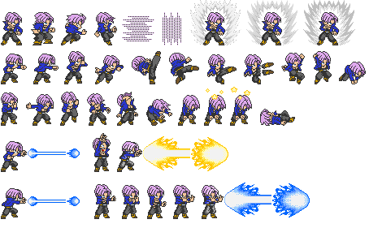
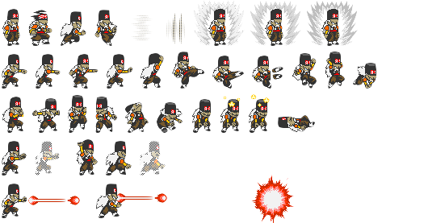
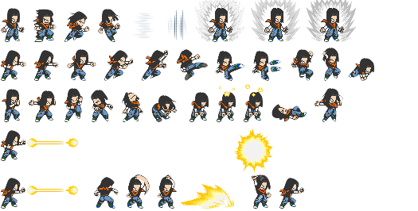
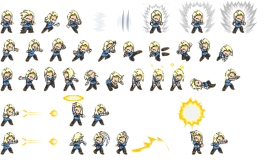

# Rust Dragon Ball Z 

Author Pablo Picouto Garcia

Dragon Ball Z Fight Game Engine Using [Bevy](https://bevyengine.org)

All used Sprites are coming from  [spriters-resource](https://www.spriters-resource.com)

You can also find the [crates.io](https://crates.io/crates/dragon_ball) 


https://github.com/politrons/FunctionalRust/assets/2054461/aa0b7a0c-687b-4866-9af5-d3742334af77


https://github.com/politrons/FunctionalRust/assets/2054461/eef4da97-e9d4-4637-b642-77938e27cd48


https://github.com/politrons/FunctionalRust/assets/2054461/d35eb1b5-d29e-48fb-90e2-069f040c4f73

## Players


## Sprites









## How to Play

Clone the repo, and run ```Main``` class

## Keyboard

```<-``` Dodge.

```Space``` Attack.

```Enter``` Super Attack.

```S``` Super Saiyan mode.


