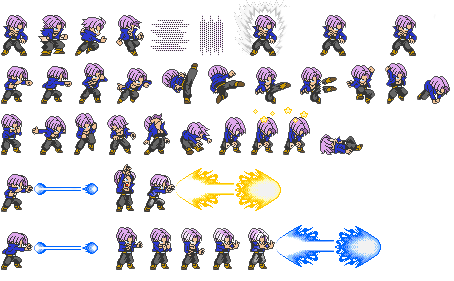

# Rust Dragon Ball Z 

Author Pablo Picouto Garcia

Dragon ball Fight Game Engine Using [Bevy](https://bevyengine.org)

All used Sprites are coming from  [spriters-resource](https://www.spriters-resource.com)


https://github.com/politrons/FunctionalRust/assets/2054461/37a0c450-50a3-42cc-a2bd-1e55292abd30
https://github.com/politrons/FunctionalRust/assets/2054461/1af80e67-6fad-462b-a1e1-a1848b27edef
https://github.com/politrons/FunctionalRust/assets/2054461/f881899c-f09f-4f29-b288-495b9e488d37

## Players


## Sprites




## How to Play

Clone the repo, and run ```Main``` class

## Keyboard

```<-``` Dodge.

```Space``` Attack.

```Enter``` Super Attack.

```S``` Super Saiyan mode.


