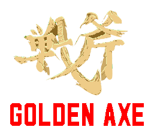
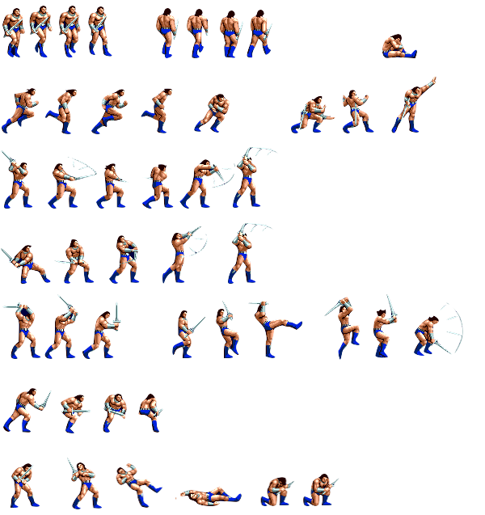
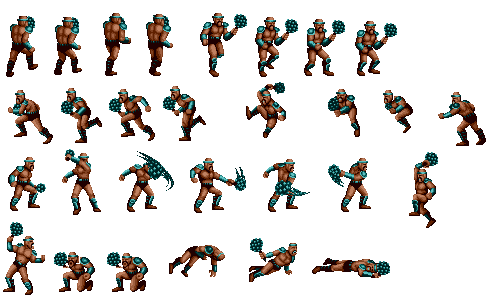
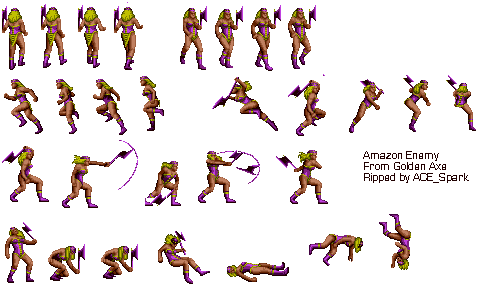

# Rust Golden Axe




Author Pablo Picouto Garcia


https://github.com/politrons/FunctionalRust/assets/2054461/a8c4051e-556b-459c-b43d-9dfefa182a85


https://github.com/politrons/FunctionalRust/assets/2054461/f373403e-9afb-4e0d-ad2e-27b96999f649


https://github.com/politrons/FunctionalRust/assets/2054461/b780a38c-d20a-4d19-9173-004ff45369a8


Golden Axe Game Engine Using [Bevy](https://bevyengine.org)

All used Sprites are coming from  [spriters-resource](https://www.spriters-resource.com)

[//]: # (You can also find the [crates.io]&#40;https://crates.io/crates/dragon_ball&#41; )

## Sprites







## How to Play

Clone the repo, and run ```Main``` class

## Keyboard

```<-``` Left ```->``` Right ```^``` Up ```v``` Down

```Space``` Attack.

```Shift``` + ```direction``` Run.


