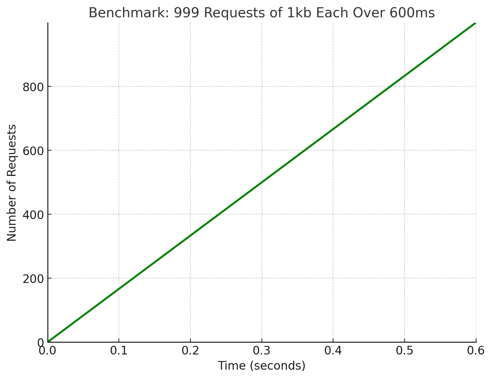
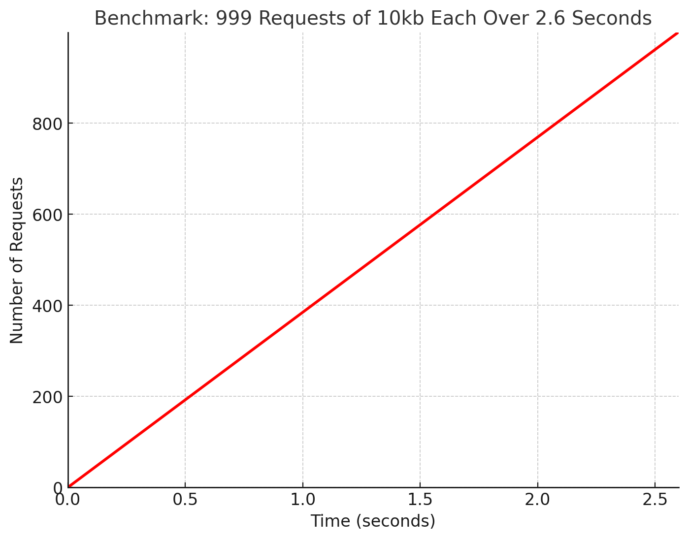
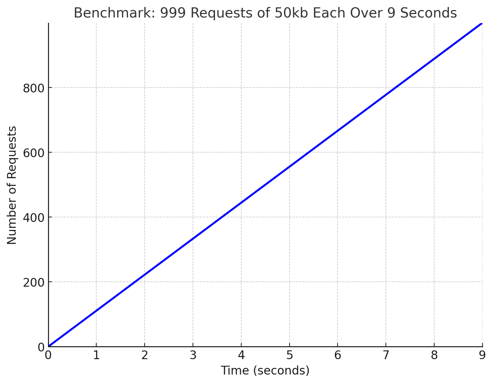

# QUIC Client-Server 

This project demonstrates a simple QUIC client-server communication using the [quiche](https://github.com/cloudflare/quiche) library in Rust. The client sends multiple requests to the server over QUIC, and the server responds with acknowledgments for each stream.

## Features

- Utilizes the QUIC protocol for fast and secure UDP communication.
- Client sends up to 999 requests in parallel on bidirectional streams.
- Server handles multiple concurrent connections and responds to each request.
- Demonstrates stream-based data transfer with flow control using the `quiche` library.

## Requirements

- **Rust**: Latest stable version recommended.
- **`quiche` library**: To install and use the quiche library, refer to its [official documentation](https://github.com/cloudflare/quiche).
- **TLS Certificate**: You need a valid TLS certificate (`cert.crt`) and a private key (`cert.key`) for the server.

### Dependencies

To include `quiche` in your Rust project, add it to your `Cargo.toml`:

```toml
[dependencies]
quiche = "0.22.0"
```

## Run

Run server
```
cargo run --bin server
```
Run client
```
cargo run --bin client
```

## Benchmarks




