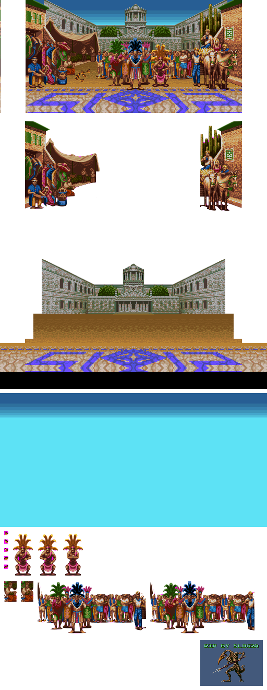

# Rust Street Fighter 2

Author Pablo Picouto Garcia

Street Fighter 2 Game Engine Using [Bevy](https://bevyengine.org)

All used Sprites are coming from  [spriters-resource](https://www.spriters-resource.com)


## Players


## Sprites





## How to Play

Clone the repo, and run ```Main``` class

## Keyboard

```<-``` Left ```->``` Right ```^``` Up ```v``` Down

```A``` Fist.

```S``` Kick.

```D``` Hadoken.

```<-``` Block under attack.


