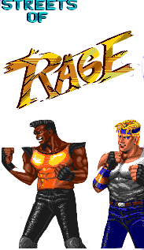
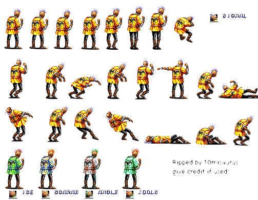

# Rust Street of Rage



Author Pablo Picouto Garcia

Street of Rage Game Engine Using [Bevy](https://bevyengine.org)

All used Sprites are coming from  [spriters-resource](https://www.spriters-resource.com)

You can also find the [crates.io](https://crates.io/crates/golden_axe)


https://github.com/politrons/FunctionalRust/assets/2054461/ef72c692-9c2b-4258-81c7-f912df03d296


https://github.com/politrons/FunctionalRust/assets/2054461/78af7410-81db-406d-a82f-71aa4c5275f2


## Sprites





## How to Play

Clone the repo, and run ```Main``` class

## Keyboard

```<-``` Left ```->``` Right ```^``` Up ```v``` Down

```Shift``` + ```direction``` Run.

```A``` Fist.

```S``` Hook.

```D``` Knee.


