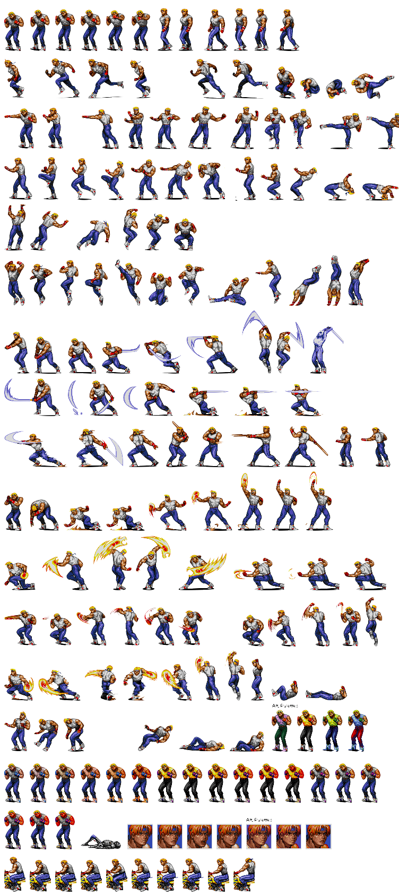

# Rust Street of Rage

Author Pablo Picouto Garcia

Street of Rage Game Engine Using [Bevy](https://bevyengine.org)

All used Sprites are coming from  [spriters-resource](https://www.spriters-resource.com)

You can also find the [crates.io](https://crates.io/crates/golden_axe)

## Sprites




## How to Play

Clone the repo, and run ```Main``` class

## Keyboard

```<-``` Left ```->``` Right ```^``` Up ```v``` Down

```Shift``` + ```direction``` Run.

```A``` Fist.

```S``` Hook.

```D``` Knee.


